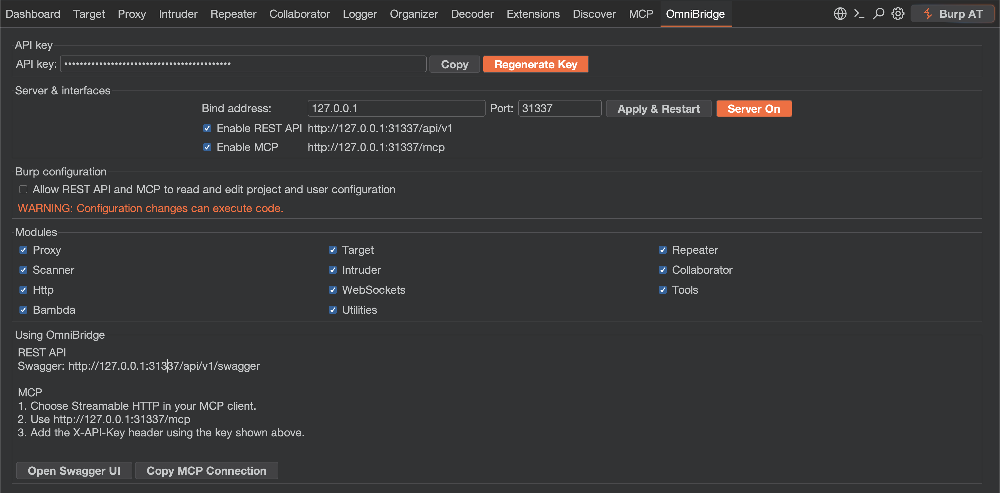
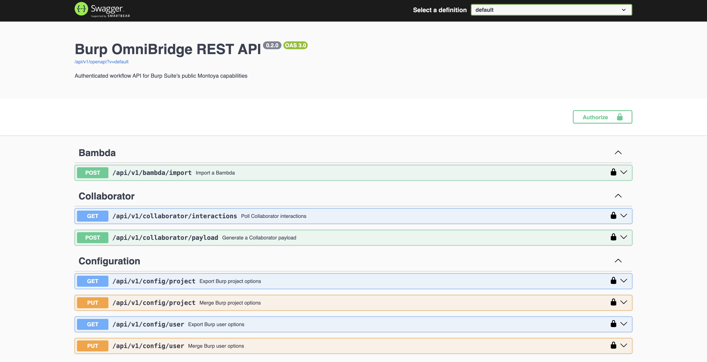

# Burp OmniBridge

Burp OmniBridge is a Kotlin extension for Burp Suite Professional that exposes safe, documented
[Montoya API](https://portswigger.github.io/burp-extensions-montoya-api/javadoc/) workflows through
an authenticated REST API and Model Context Protocol (MCP) endpoint.

The extension starts asynchronously at `http://127.0.0.1:31337`. Its Burp tab is named **OmniBridge**.
The tab controls the bind address, port, API key, server lifecycle, independent REST/MCP interfaces,
and live module permissions shared by both interfaces.

## Screenshots

### OmniBridge tab



### Swagger UI



## Build and install

Requirements:

- JDK 21 for building (the generated bytecode targets Java 17)
- A Burp Suite release compatible with Montoya API 2026.7

Build and test:

```shell
./gradlew clean build
```

Load `output/burp-omnibridge.jar` in **Extensions → Installed → Add**, selecting Java as the
extension type. The Montoya API itself is deliberately excluded from the fat JAR because Burp
provides it at runtime.

Every push to `main` runs the complete test and fat-JAR verification suite. The workflow uploads
the JAR as a retained Actions artifact and publishes a new immutable
[versioned release](https://github.com/xhzeem/burp-omniapi/releases/latest). Release tags use
`v<project-version>-build.<run-number>`, and every release contains exactly one asset:
`burp-omnibridge.jar`.

Open the **OmniBridge** tab to copy the generated `X-API-Key`. A new 256-bit key is created on each
extension load. Protected endpoints accept the key either in the recommended `X-API-Key` header or
in an `apiKey` query parameter for browser-based GET requests.

## Quick start

```shell
OMNIAPI_KEY='copy-from-the-OmniBridge-tab'

curl http://127.0.0.1:31337/health

curl -H "X-API-Key: $OMNIAPI_KEY" \
  http://127.0.0.1:31337/api/v1/system/capabilities

curl -H "X-API-Key: $OMNIAPI_KEY" \
  'http://127.0.0.1:31337/api/v1/proxy/history?offset=0&limit=100'

# Browser-compatible GET authentication
curl "http://127.0.0.1:31337/api/v1/system/info?apiKey=$OMNIAPI_KEY"
```

Swagger UI is available at [http://127.0.0.1:31337/api/v1/swagger](http://127.0.0.1:31337/api/v1/swagger), and
the generated OpenAPI document is available at `/api/v1/openapi`. Enter the copied key using Swagger's
**Authorize** button before invoking protected operations.

## MCP

MCP clients connect to the Streamable HTTP endpoint at:

```text
http://127.0.0.1:31337/mcp
```

Configure the same `X-API-Key` header shown in the OmniBridge tab. The endpoint supports MCP
initialization, tool discovery, JSON responses, and stateless tool calls. The initial tool set can:

- read system and enabled-module information;
- send binary-safe HTTP requests through Burp;
- page through Proxy HTTP history;
- open requests in Repeater or Intruder.

The REST API and MCP endpoint can be enabled independently in the OmniBridge tab. Module switches
apply immediately to both interfaces.

Configuration editing is disabled by default. Enabling **Burp configuration → Allow REST API and
MCP to read and edit project and user configuration** permits authenticated clients to read and
merge Burp project/user options. Treat this as code-execution access: Burp configuration can load
or invoke executable components.

## Modules and endpoints

All REST paths below, except `/health`, are relative to `/api/v1`.

| Module | Endpoints |
|---|---|
| System | `GET /health`, `GET /system/info`, `GET /system/capabilities` |
| Proxy | `GET /proxy/history`, `POST /proxy/intercept` |
| Target | `GET /target/sitemap`, `POST /target/scope` |
| Repeater | `POST /repeater/send` |
| Scanner | `POST /scanner/scan`, `GET /scanner/tasks/{id}`, `GET /scanner/issues` |
| Intruder | `POST /intruder/attack` |
| Collaborator | `POST /collaborator/payload`, `GET /collaborator/interactions` |
| Configuration | `GET/PUT /config/project`, `GET/PUT /config/user` (advanced gate required) |
| HTTP | `POST /http/send`, `GET/PUT /http/cookies` |
| WebSockets | `POST /websockets`, message/event routes, `DELETE /websockets/{id}` |
| Tools | Decoder, Comparer, and Organizer routes under `/tools` |
| Bambda | `POST /bambda/import` |
| Utilities | `POST /utilities/transform` |

The pre-`/api/v1` paths remain available as deprecated aliases for 0.x clients and return
`Deprecation` and successor `Link` headers.

History, site-map, issue, interaction, WebSocket-event, and Organizer reads use `offset` and `limit`;
the default limit is 100 and the maximum is 500. HTTP messages and other arbitrary bytes are
transported as RFC 4648 base64.

## Capability boundaries

OmniBridge uses only public Montoya APIs. It returns HTTP `501` with
`MONTOYA_CAPABILITY_UNAVAILABLE` when a request asks for a Burp behavior Montoya does not expose:

- enumerating or retroactively forwarding/dropping Proxy's current interception queue;
- targeting an already-existing Repeater tab;
- forcing a passive scan;
- configuring Intruder payload lists or attack type, or launching an Intruder attack.

The supported Intruder workflow opens a tab with a request template and validated insertion points.

OmniBridge intentionally does not expose operating-system command execution, Burp shutdown,
extension unload, AI prompts, persistence internals, or arbitrary UI registration. Burp option
import/export is available only through the disabled-by-default advanced MCP gate.

## Security

- Keep the default loopback bind unless remote access is genuinely required.
- Changing the bind address or port requires **Apply & Restart** in the OmniBridge tab.
- Regenerating the API key invalidates the previous key immediately.
- Prefer the `X-API-Key` header. An `apiKey` query parameter is convenient for browser GET requests,
  but URLs can be retained in browser history, proxy history, and access logs.
- CORS is disabled and request bodies are limited to 16 MiB.
- OmniBridge does not terminate TLS. For non-loopback use, place it behind an authenticated TLS reverse
  proxy and restrict access at the host/network layer.
- API keys and raw message bodies are never written to OmniBridge logs.

See [SECURITY.md](SECURITY.md) for reporting and deployment guidance.

The implementation-to-review mapping for PortSwigger's current requirements is documented in
[BAPP_ACCEPTANCE.md](BAPP_ACCEPTANCE.md). Run `./gradlew verifyShadowJar` to verify that the
submission artifact contains Javalin, Jetty, Jackson, generated OpenAPI metadata, and locally hosted
Swagger assets while excluding the Burp-provided Montoya API classes.

## License

Burp OmniBridge is released under the [MIT License](LICENSE).
